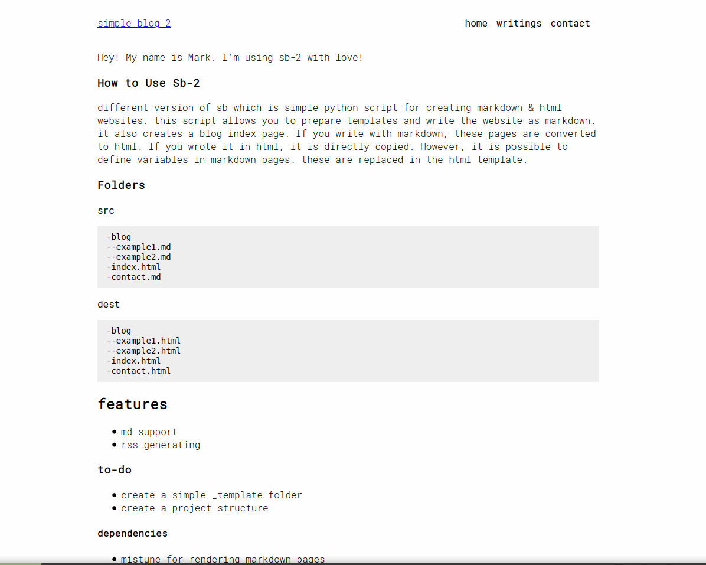

# Sb-2
Different version of sb which is simple python script for creating markdown & html websites. this script allows you to prepare templates and write the website as markdown. it also creates a blog index page. If you write with markdown, these pages are converted to html. If you wrote it in html, it is directly copied. However, it is possible to define variables in markdown pages. these are replaced in the html template.



## Folders
If you write directly HTML page, it will not converted and directly copied to _site folder. 

**src**
```
-blog
--example1.md
--example2.md
-index.html
-contact.md
```

**dest**
```
-blog
--example1.html
--example2.html
-index.html
-contact.html
```

## Commands
* Create new blog
```bash
python3 sb-2 -n "My New Blog"
```
* Generate blog page
```bash
python3 sb-2 generate
```

## Features
- MD Support [Thanks to mistune](https://github.com/lepture/mistune)
- RSS Feed
- Template Structure

### Dependencies
- mistune for rendering markdown pages
